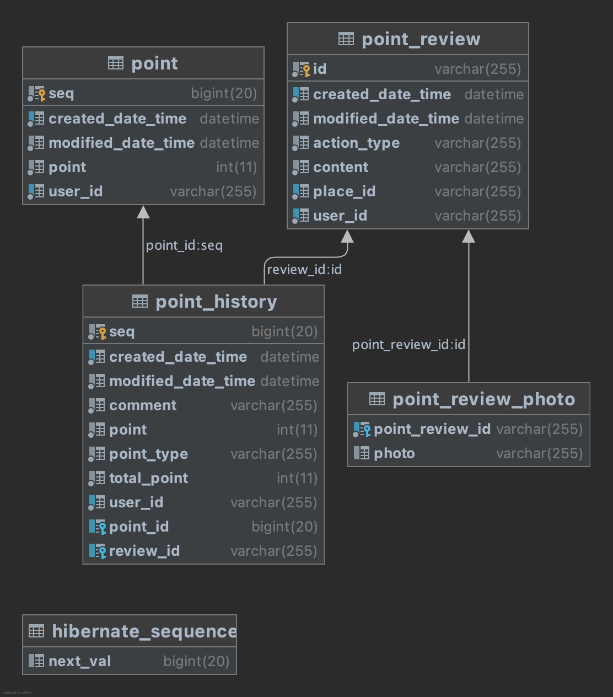

# 여행자 클럽 마일리지 서비스 
## 프로젝트 설명
사용자들이 장소에 리뷰를 작성할 때 포인트를 부여하고, 전체/개인에 대한 포인트 부여 히스토리와 개인별 누적 포인트를 관리하고자 한다.

## SPECIFICATIONS
리뷰 작성이 이뤄질때마다 리뷰 작성 이벤트가 발생하고, 아래 API로 이벤트를 전달한다.  
POST /events  
~~~json
{
  "type": "REVIEW",
  "action": "ADD",
  "reviewId": "240a0658-dcf5-4878-9381-ebb7b2667772",
  "content": "좋아요!",
  "attachedPhotoIds": ["e4d1a64e-a531-46de-898d-fsjlkfjdklsf", "3123da-djasldjasl-dqsdd"],
  "userId": "3123jdlkajda-user-1",
  "placeId": "djaskldjkas-placeId-1"
}
~~~

* type: 미리 정의된 string 값을 가지고 있다. 리뷰 이벤트의 경우 "REVIEW" 로 오게된다.
* action: 리뷰 생성 이벤트의 경우 "ADD", 수정 이벤트는 "MOD", 삭제 이벤트는 "DELETE" 값을 가진다.
* reviewId: 어떤 리뷰에 대한 이벤트인지 가리키는 값이다.
* content: 리뷰의 내용
* attachedPhotoIds: 리뷰에 첨부된 이미지들의 id 배열
* userId: 리뷰의 작성자 id
* placeId: 리뷰가 작성된 장소의 Id

한 사용자는 장소마다 리뷰를 1개만 작성할 수 있고, 리뷰는 수정 또는 삭제 할 수 있다. 리뷰 보상 점수는 아래와 같다.
* 내용 점수
  * 1자 이상 텍스트 작성: 1점
  * 1장 이상 사진 첨부: 1점
* 보너스 점수
  * 특정 장소에 첫 리뷰 작성: 1점
  

* 구현 API
  * POST /events로 호출하는 포인트 적립 API
  * 포인트 조회 API

## REMARKS
* 포인트 증감이 있을 때마다 이력이 남아야 한다.
* 사용자마다 현재 시점의 포인트 총점을 조회하거나 계산할 수 있어야 한다.
* 포인트 부여 API 구현에 필요한 SQL 수행시, 전체 테이블 스캔이 일어나지 않는 인덱스 필요
* 리뷰를 작성했다가 삭제함녀 해당 리뷰로 부여한 내용 점수와 보너스 점수 회수
* 리뷰 수정시 수정한 내용에 맞는 내용 점수를 계산하여 점수를 부여하거나 회수
  * 글만 작성한 리뷰에 사진 추가시 1점 부여
  * 글과 사진이 있는 리뷰에서 사진을 모두 삭제하면 1점 회수
* 사용자 입장에서 본 '첫 리뷰'일 때 보너스 점수 부여
  * 어떤 장소에서 사용자 A가 리뷰를 남겼다가 삭제하고, 삭제된 이후 사용자 B가 리뷰를 남기면 사용자 B에게 보너스 점수를 부여하지 않는다.

---
# API환경 구성 가이드

## 사용기술
* kotlin
* spring-boot 
* spring-boot-starter-data-jpa
* mysql
* kotest
* testcontainers
* docker-compose

## 실행방법
* sudo yum install java-11-openjdk-devel (자바 11 설치)
* sudo /usr/sbin/alternatives --config java (자바 11 선택)
* sudo yum install git (깃 설치)
* curl -fsSL https://get.docker.com/ | sh (docker 설치 )
* sudo systemctl start docker (docker 서비스 시작)
* sudo curl -L "https://github.com/docker/compose/releases/download/1.27.4/docker-compose-$(uname -s)-$(uname -m)" -o /usr/local/bin/docker-compose (docker compose 설치)
* sudo chmod +x /usr/local/bin/docker-compose (docker compose 실행 권한 부여)
* git clone https://github.com/055055/point.git (프로젝트 클론)
* cd point/
* docker-compose up -d
* ./gradlew build (프로젝트 빌드)
* nohup java -jar ./point/build/libs/point-0.0.1-SNAPSHOT.jar 2>&1 & (프로젝트 실행)

---
## Database DDL



```sql
create table hibernate_sequence
(
    next_val bigint null
);
```
```sql
create table point
(
  seq                bigint auto_increment
    primary key,
  created_date_time  datetime     not null,
  modified_date_time datetime     not null,
  point              int          not null,
  user_id            varchar(255) not null,
  constraint point_index_1
    unique (user_id)
);

create index point_index_2
  on point (created_date_time);
```

```sql
create table point_history
(
    seq                bigint       not null
        primary key,
    created_date_time  datetime     not null,
    modified_date_time datetime     not null,
    comment            varchar(255) not null,
    point              int          not null,
    point_type         varchar(255) not null,
    total_point        int          not null,
    user_id            varchar(255) not null,
    point_id           bigint       null,
    review_id          varchar(255) null,
    constraint point_history_index_1
        unique (user_id),
    constraint fk_point_id
        foreign key (point_id) references point (seq),
    constraint fk_review_id
        foreign key (review_id) references point_review (id)
);

create index point_history_index_2
    on point_history (created_date_time);

```

```sql
create table point_review
(
    id                 varchar(255) not null
        primary key,
    created_date_time  datetime     not null,
    modified_date_time datetime     not null,
    action_type        varchar(255) not null,
    content            varchar(255) not null,
    place_id           varchar(255) not null,
    user_id            varchar(255) not null
);

create index point_review_index_1
    on point_review (place_id, user_id);

create index point_review_index_2
    on point_review (created_date_time);
```

```sql
create table point_review_photo
(
    point_review_id varchar(255) not null,
    photo           varchar(255) null,
    constraint FKd7ts9290j1ofejijebsksxbxh
        foreign key (point_review_id) references point_review (id)
);
```
